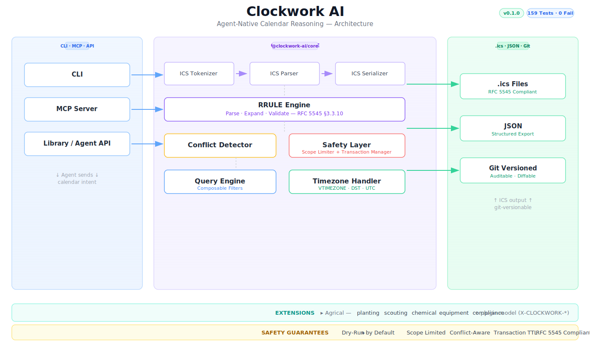

# Clockwork

[](https://www.typescriptlang.org/)
[](https://opensource.org/licenses/MIT)
[](https://github.com/0-CYBERDYNE-SYSTEMS-0/clockwork-ai/stargazers)

**ICS-native reasoning layer for AI agents**

[](https://github.com/0-CYBERDYNE-SYSTEMS-0/clockwork-ai)
[](https://nodejs.org)
[](./LICENSE)
[](https://datatracker.ietf.org/doc/html/rfc5545)

Clockwork is an open-source TypeScript library and CLI that gives AI agents first-class tools to read, write, query, and reason about calendar data. It uses the ICS standard (RFC 5545) as its canonical format — no API keys, no rate limits, no vendor lock-in.

**Why this exists:** AI agents need to schedule things. Existing calendar APIs (Google, Outlook, Apple) require OAuth, hit rate limits, and can't be version-controlled. ICS files are plain text, work offline, are git-versionable, and every calendar app can read them. Clockwork makes ICS agent-native.

---

## What's Built & Verified

| Module | Status | Description |
|--------|--------|-------------|
| **ICS Parser + Serializer** | ✅ | RFC 5545 tokenizer, parser, serializer — full round-trip fidelity |
| **RRULE Engine** | ✅ | Parse, expand, validate recurrence rules (FREQ, INTERVAL, UNTIL, COUNT, BYDAY, BYMONTHDAY, BYMONTH, EXDATE, RDATE) |
| **Conflict Detection** | ✅ | Overlap detection with severity classification and resolution options |
| **Query Engine** | ✅ | Composable filters: after, before, overlaps, hasTag, inDateRange, duration bounds |
| **Validator** | ✅ | RFC 5545 compliance checks: missing FREQ, invalid intervals, day codes, infinite recurrence |
| **Timezone Handler** | ✅ | VTIMEZONE parsing, UTC/floating detection, DST transition awareness |
| **Scope Limiter** | ✅ | Per-agent read/write path boundaries for safe multi-agent operations |
| **Agrical Extension** | 🚧 | 5 mission types (planting, scouting, chemical, equipment, compliance) — code complete, tests pending |
| **CLI** | ✅ | 7 commands via Commander: validate-rrule, resolve-recurrence, find-conflicts, plan-windows, create-event, query-events, create-mission |
| **Transaction System** | 🚧 | Dry-run scaffolding exists; scope enforcement integration in-progress |

**Total: 159 tests, 7 suites, 0 failures — verified 2026-04-27.**

---

## Quick Start

### Install

```bash
git clone https://github.com/0-CYBERDYNE-SYSTEMS-0/clockwork-ai.git
cd clockwork-ai
npm install
npm run build
```

### CLI

```bash
# Validate a recurrence rule
clockwork validate-rrule "FREQ=WEEKLY;BYDAY=MO,WE,FR;COUNT=52"

# Expand recurrence to concrete dates
clockwork resolve-recurrence --rrule "FREQ=DAILY;INTERVAL=2" --from 2026-04-01 --to 2026-04-30

# Find scheduling conflicts
clockwork find-conflicts --calendar ./missions.ics --on 2026-04-18

# Plan available time windows
clockwork plan-windows --calendar ./missions.ics --on 2026-04-20 --duration 3h --count 3

# Create an event (dry-run by default)
clockwork create-event --summary "Corn planting" --start 2026-04-15T08:00 --end 2026-04-15T18:00 --calendar ./missions.ics

# Query with natural language
clockwork query-events --calendar ./missions.ics --filter "planting windows this month"

# Create an agricultural mission
clockwork create-mission planting --crop corn --variety "Pioneer P1197" --field north-40 --window 2026-04-15/2026-04-22 --calendar ./farm-missions.ics
```

### Library

```typescript
import {
  ICSParser,
  ICSSerializer,
  RRuleParser,
  RRuleExpander,
  RRuleValidator,
  ConflictDetector,
  TimezoneHandler,
} from '@clockwork-ai/core';

// Parse ICS
const parser = new ICSParser();
const calendar = parser.parse(icsString);
console.log(calendar.events.length); // number of VEVENTs

// Validate recurrence
const rruleParser = new RRuleParser();
const rrule = rruleParser.parse('FREQ=WEEKLY;BYDAY=MO,WE,FR;COUNT=12');
const validator = new RRuleValidator();
const result = validator.validate(rrule);
console.log(result.valid, result.errors); // true/false + structured errors

// Expand to dates
const expander = new RRuleExpander();
const dates = expander.expand(rrule, startDate, rangeStart, rangeEnd);
console.log(dates.map(d => d.toISOString()));

// Detect conflicts
const detector = new ConflictDetector();
const conflicts = detector.detect(events);
conflicts.forEach(c => console.log(`${c.severity}: ${c.description}`));

// Serialize back to ICS
const serializer = new ICSSerializer();
const output = serializer.serializeCalendar(calendar);
```

---

## Architecture



> **[Open interactive diagram →](https://excalidraw.com/#json=Rbs8W0_-xbfHNIvCenZEv,AxuFbyMPeKViZ4DrTyfskQ)** — zoom, pan, and inspect the full architecture on Excalidraw.

Clockwork is organized as a monorepo with three packages:

---

## Safety Model

Clockwork is designed for autonomous agent use. Every operation that modifies data operates on a safety-first model:

- **Dry-run by default** — Mutations show a preview before committing. Pass `--commit` to write.
- **Conflict detection** — Before any write, Clockwork checks for temporal overlaps, resource contention, and constraint violations.
- **Scope limiter** — Agents operate within enforced path boundaries (e.g., read `./farm/*.ics`, write `./farm/missions.ics`).
- **Transaction TTL** — Pending operations auto-expire after 5 minutes.

---

## Domain Extensions

Clockwork uses ICS X-properties (`X-CLOCKWORK-*`) for domain-specific semantics that survive round-trip through any ICS-compatible tool.

### Agrical (Agriculture)

Five mission types for farming operations:

| Type | Key Fields | Example Use |
|------|-----------|-------------|
| **planting** | crop, variety, field, window | Schedule corn planting for north-40 |
| **scouting** | observationType, field, linkedEvent | Post-planting field inspection |
| **chemical** | chemicalType, temperature constraints | Herbicide with 15–25°C window |
| **equipment** | equipmentId, maintenanceType | Tractor service tied to crop phase |
| **compliance** | complianceType, jurisdiction | EPA reporting deadline Q2 2026 |

Extensible: add your own mission types with custom validators and X-property schemas.

---

## Project Structure

```
clockwork-ai/
├── packages/
│   ├── core/              # ICS engine — parser, RRULE, validator, timezone, conflicts, query
│   │   ├── src/           # 13 source files
│   │   └── tests/         # 7 test suites, 159 tests, 0 failures
│   ├── cli/               # Commander-based CLI — 7 commands
│   │   ├── src/           # 10 source files
│   │   └── tests/
│   └── extensions/
│       └── agrical/       # Agricultural domain extension — 5 mission types
│           ├── src/
│           └── tests/
├── package.json           # npm workspaces + Turborepo
└── SPEC-v0.2.0.md         # Next-phase roadmap
```

---

## Roadmap

See [`SPEC-v0.2.0.md`](./SPEC-v0.2.0.md) for the detailed plan. Key next steps:

1. ~~Fix all failing tests~~ ✅ Done — 159/159 passing
2. **Deduplicate RRULE parser** (ICSParser has duplicate logic)
3. **Complete VTIMEZONE parsing** (STANDARD/DAYLIGHT sub-components)
4. **Wire scope enforcement** into transaction manager
5. **CI/CD** — GitHub Actions
6. **MCP Server** — Expose all Clockwork tools as MCP endpoints for Claude, Hermes, Cursor, etc.

---

## Why ICS?

| | Google Calendar | Outlook | ICS + Clockwork |
|---|----------------|---------|-----------------|
| Authentication | OAuth required | OAuth required | **None** (file-based) |
| Rate Limits | Yes | Yes | **No** |
| Offline | Limited | Limited | **Full** |
| Git-versionable | No | No | **Yes** |
| Agent-native | No | No | **Yes** |
| Vendor Lock-in | High | High | **None** |

---

## License

MIT — Copyright (c) 2026 FarmFriend Labs

---

## Links

- **Paper:** [Clockwork: Agent-Native Calendar Reasoning](./PAPER.md)
- **GitHub:** [0-CYBERDYNE-SYSTEMS-0/clockwork-ai](https://github.com/0-CYBERDYNE-SYSTEMS-0/clockwork-ai)
- **Issues:** [Report a bug](https://github.com/0-CYBERDYNE-SYSTEMS-0/clockwork-ai/issues)
