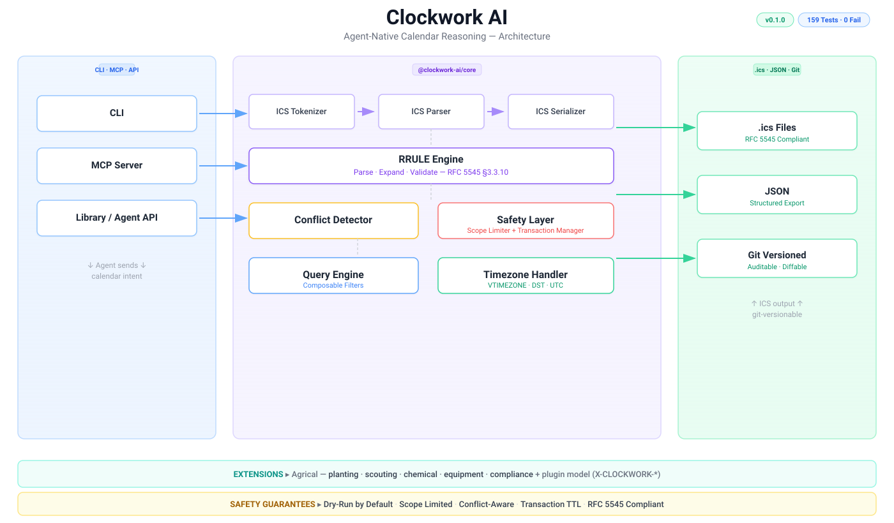

# Clockwork

[](https://www.typescriptlang.org/)
[](https://nodejs.org)
[](https://opensource.org/licenses/MIT)
[](https://datatracker.ietf.org/doc/html/rfc5545)
[](https://github.com/0-CYBERDYNE-SYSTEMS-0/clockwork-ai)
[](https://github.com/0-CYBERDYNE-SYSTEMS-0/clockwork-ai/stargazers)

**ICS-native reasoning layer for AI agents**

Clockwork is an open-source TypeScript library and CLI that gives AI agents first-class tools to read, write, query, and reason about calendar data. It uses the ICS standard (RFC 5545) as its canonical format — no API keys, no rate limits, no vendor lock-in.

**Why this exists:** AI agents need to schedule things. Existing calendar APIs (Google, Outlook, Apple) require OAuth, hit rate limits, and can't be version-controlled. ICS files are plain text, work offline, are git-versionable, and every calendar app can read them. Clockwork makes ICS agent-native.

**Who is this for:** AI agent developers, calendar integration engineers, and anyone building autonomous scheduling systems. If your agent needs to read, write, or reason about calendar data without OAuth tokens or cloud dependencies, Clockwork is for you.

---

## What's Built & Verified

|| Module | Status | Description |
||--------|--------|-------------|
|| **ICS Parser + Serializer** | ✅ | RFC 5545 tokenizer, parser, serializer — full round-trip fidelity, single RRULE parser |
|| **RRULE Engine** | ✅ | Parse, expand, validate recurrence rules (FREQ, INTERVAL, UNTIL, COUNT, BYDAY, BYMONTHDAY, BYMONTH, EXDATE, RDATE) |
|| **Conflict Detection** | ✅ | Overlap detection with severity classification and resolution options |
|| **Query Engine** | ✅ | Composable filters: after, before, overlaps, hasTag, inDateRange, duration bounds |
|| **Validator** | ✅ | RFC 5545 compliance checks: missing FREQ, invalid intervals, day codes, infinite recurrence |
|| **Timezone Handler** | ✅ | Full VTIMEZONE parsing (STANDARD/DAYLIGHT), DST transition awareness |
|| **Scope Limiter** | ✅ | Per-agent read/write path boundaries, wired into transaction manager |
|| **Agrical Extension** | ✅ | 5 mission types (planting, scouting, chemical, equipment, compliance) — 26/26 tests passing |
|| **CLI** | ✅ | 7 commands via Commander, shebang, full binary entry point |
|| **Transaction System** | ✅ | Dry-run, scope enforcement, TTL-based pending ops, rollback |
|| **MCP Server** | ✅ | 7 tools exposed: validate_rrule, resolve_recurrence, find_conflicts, plan_windows, create_event, query_events, create_mission |

**Total: 196 tests, 9 suites, 0 failures — verified 2026-05-08 (v0.2.0).**

---

## Quick Start

### Install

```bash
git clone https://github.com/0-CYBERDYNE-SYSTEMS-0/clockwork-ai.git
cd clockwork-ai
npm install
npm run build
```

### CLI

```bash
# Validate a recurrence rule
clockwork validate-rrule "FREQ=WEEKLY;BYDAY=MO,WE,FR;COUNT=52"

# Expand recurrence to concrete dates
clockwork resolve-recurrence --rrule "FREQ=DAILY;INTERVAL=2" --from 2026-04-01 --to 2026-04-30

# Find scheduling conflicts
clockwork find-conflicts --calendar ./missions.ics --on 2026-04-18

# Plan available time windows
clockwork plan-windows --calendar ./missions.ics --on 2026-04-20 --duration 3h --count 3

# Create an event (dry-run by default)
clockwork create-event --summary "Corn planting" --start 2026-04-15T08:00 --end 2026-04-15T18:00 --calendar ./missions.ics

# Query with natural language
clockwork query-events --calendar ./missions.ics --filter "planting windows this month"

# Create an agricultural mission
clockwork create-mission planting --crop corn --variety "Pioneer P1197" --field north-40 --window 2026-04-15/2026-04-22 --calendar ./farm-missions.ics
```

### MCP Server (AI Agent Integration)

Clockwork ships an MCP server that exposes all 7 tools to any MCP-capable agent (Claude Desktop, Hermes, Cursor, Continue, etc.):

```json
{
  "mcpServers": {
    "clockwork": {
      "command": "node",
      "args": ["/path/to/clockwork-ai/packages/mcp/dist/index.js"]
    }
  }
}
```

Available MCP tools: `validate_rrule`, `resolve_recurrence`, `find_conflicts`, `plan_windows`, `create_event`, `query_events`, `create_mission`.

### Library

```typescript
import {
  ICSParser,
  ICSSerializer,
  RRuleParser,
  RRuleExpander,
  RRuleValidator,
  ConflictDetector,
  TimezoneHandler,
} from '@clockwork-ai/core';

// Parse ICS
const parser = new ICSParser();
const calendar = parser.parse(icsString);
console.log(calendar.events.length); // number of VEVENTs

// Validate recurrence
const rruleParser = new RRuleParser();
const rrule = rruleParser.parse('FREQ=WEEKLY;BYDAY=MO,WE,FR;COUNT=12');
const validator = new RRuleValidator();
const result = validator.validate(rrule);
console.log(result.valid, result.errors); // true/false + structured errors

// Expand to dates
const expander = new RRuleExpander();
const dates = expander.expand(rrule, startDate, rangeStart, rangeEnd);
console.log(dates.map(d => d.toISOString()));

// Detect conflicts
const detector = new ConflictDetector();
const conflicts = detector.detect(events);
conflicts.forEach(c => console.log(`${c.severity}: ${c.description}`));

// Serialize back to ICS
const serializer = new ICSSerializer();
const output = serializer.serializeCalendar(calendar);
```

### Show Me the Code (End-to-End)

```typescript
import { ICSParser, ConflictDetector, ICSSerializer } from '@clockwork-ai/core';

// 1. Parse the farm's mission calendar
const parser = new ICSParser();
const calendar = parser.parse(fs.readFileSync('./farm-missions.ics', 'utf-8'));

// 2. Propose a new planting event
const proposedEvent = {
  uid: 'plant-corn-001@farmfriend',
  summary: 'Corn Planting — Pioneer P1197',
  start: { date: new Date('2026-04-15T08:00:00'), timezone: 'America/Chicago', isAllDay: false },
  end:   { date: new Date('2026-04-15T18:00:00'), timezone: 'America/Chicago', isAllDay: false },
  // ...
};

// 3. Check for conflicts before committing
const detector = new ConflictDetector();
const conflicts = detector.detectAgainst(proposedEvent, calendar.events);

if (conflicts.length > 0) {
  console.error(`❌ ${conflicts.length} conflict(s) found:`);
  conflicts.forEach(c => console.log(`  • ${c.severity}: ${c.description} (resolve: ${c.resolution})`));
  process.exit(1);
}

// 4. Safe to commit — serialize back to ICS
calendar.events.push(proposedEvent);
const serializer = new ICSSerializer();
const output = serializer.serializeCalendar(calendar);
fs.writeFileSync('./farm-missions.ics', output);
console.log('✅ Event added. No conflicts detected.');
```

---

## Architecture



> **[Open interactive diagram →](https://excalidraw.com/#json=Rbs8W0_-xbfHNIvCenZEv,AxuFbyMPeKViZ4DrTyfskQ)** — zoom, pan, and inspect the full architecture on Excalidraw.

Clockwork is organized as a monorepo with three packages:

---

## Safety Model

Clockwork is designed for autonomous agent use. Every operation that modifies data operates on a safety-first model:

- **Dry-run by default** — Mutations show a preview before committing. Pass `--commit` to write.
- **Conflict detection** — Before any write, Clockwork checks for temporal overlaps, resource contention, and constraint violations.
- **Scope limiter** — Agents operate within enforced path boundaries (e.g., read `./farm/*.ics`, write `./farm/missions.ics`).
- **Transaction TTL** — Pending operations auto-expire after 5 minutes.

---

## Domain Extensions

Clockwork uses ICS X-properties (`X-CLOCKWORK-*`) for domain-specific semantics that survive round-trip through any ICS-compatible tool.

### Agrical (Agriculture)

Five mission types for farming operations:

| Type | Key Fields | Example Use |
|------|-----------|-------------|
| **planting** | crop, variety, field, window | Schedule corn planting for north-40 |
| **scouting** | observationType, field, linkedEvent | Post-planting field inspection |
| **chemical** | chemicalType, temperature constraints | Herbicide with 15–25°C window |
| **equipment** | equipmentId, maintenanceType | Tractor service tied to crop phase |
| **compliance** | complianceType, jurisdiction | EPA reporting deadline Q2 2026 |

Extensible: add your own mission types with custom validators and X-property schemas.

---

## Project Structure

```
clockwork-ai/
├── packages/
│   ├── core/              # ICS engine — parser, RRULE, validator, timezone, conflicts, query
│   │   ├── src/           # 13 source files
│   │   └── tests/         # 7 test suites, 159 tests, 0 failures
│   ├── cli/               # Commander-based CLI — 7 commands
│   │   ├── src/           # 10 source files
│   │   └── tests/         # 1 test suite, 11 tests, 0 failures
│   ├── mcp/               # MCP server — 7 tools exposed via Model Context Protocol
│   │   └── src/
│   └── extensions/
│       └── agrical/       # Agricultural domain extension — 5 mission types
│           ├── src/
│           └── tests/     # 1 test suite, 26 tests, 0 failures
├── package.json           # npm workspaces + Turborepo
└── SPEC-v0.2.0.md         # Completed — all items shipped
```

---

## Roadmap

See [`SPEC-v0.2.0.md`](./SPEC-v0.2.0.md) for the detailed plan. v0.2.0 is **COMPLETE**. Key items shipped:

1. ✅ 159/159 core tests passing — zero failures
2. ✅ RRULE parser deduplicated (single implementation)
3. ✅ Full VTIMEZONE STANDARD/DAYLIGHT parsing
4. ✅ Scope enforcement wired into transaction manager
5. ✅ CLI binary with shebang, all 7 commands
6. ✅ CI/CD via GitHub Actions
7. ✅ MCP Server — 7 tools exposed via Model Context Protocol
8. ✅ Agrical extension — 26/26 tests passing

Next frontier: CalDAV bridge, cryptographic signing, natural language query decomposition.

---

## Why ICS?

| | Google Calendar | Outlook | ICS + Clockwork |
|---|----------------|---------|-----------------|
| Authentication | OAuth required | OAuth required | **None** (file-based) |
| Rate Limits | Yes | Yes | **No** |
| Offline | Limited | Limited | **Full** |
| Git-versionable | No | No | **Yes** |
| Agent-native | No | No | **Yes** |
| Vendor Lock-in | High | High | **None** |

---

## Alternatives

| | Clockwork | rrule.js | Temporal.io | Google Calendar API |
|---|---|---|---|---|
| ICS parsing | ✅ Full RFC 5545 | ❌ | ❌ | ❌ |
| RRULE expansion | ✅ | ✅ | ❌ | ❌ |
| Conflict detection | ✅ | ❌ | ❌ | Partial |
| Dry-run safety | ✅ | ❌ | ❌ | ❌ |
| Agent-native tools | ✅ | ❌ | ✅ | ❌ |
| Offline | ✅ | ✅ | ❌ | ❌ |
| Git-versionable | ✅ | ❌ | ❌ | ❌ |
| File-based (no auth) | ✅ | ✅ | ❌ | ❌ |

Clockwork is the only library that combines ICS parsing, recurrence expansion, conflict detection, and dry-run safety into a single agent-native package.

---

## Community & Contributing

- **🐛 [Report a bug](https://github.com/0-CYBERDYNE-SYSTEMS-0/clockwork-ai/issues)**
- **💡 [Request a feature](https://github.com/0-CYBERDYNE-SYSTEMS-0/clockwork-ai/issues)**
- **📖 [Read the paper](./PAPER.md)**
- **📋 [See the roadmap](./SPEC-v0.2.0.md)**
- **🔧 [Contributing guide](./CONTRIBUTING.md)**

Contributions welcome. Check the roadmap for `help wanted` items or open an issue to discuss new domain extensions.

---

## Citation

If you use Clockwork in your research or agent system, please cite:

```bibtex
@misc{clockwork2026,
  title        = {Clockwork: Agent-Native Calendar Reasoning},
  author       = {{FarmFriend Labs}},
  year         = 2026,
  howpublished = {\\url{https://github.com/0-CYBERDYNE-SYSTEMS-0/clockwork-ai}},
  note         = {v0.1.0 — 159/159 tests passing, MIT licensed}
}
```

---

## License

MIT — Copyright (c) 2026 FarmFriend Labs
